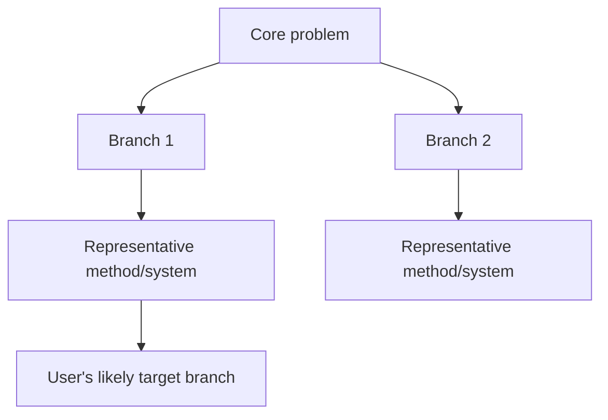

# Output Templates

## Field Skeleton



## Keyword Expansion

| Group | Terms | Why included | Search notes |
|---|---|---|---|
| Mechanism |  |  |  |
| Method/device |  |  |  |
| Object/system |  |  |  |
| Outcome |  |  |  |
| Comparator |  |  |  |
| Negative-search |  |  |  |
| Exclusion |  |  |  |

## Timeline

| Period | Main development | Representative papers | Branch impact |
|---|---|---|---|
|  |  |  |  |

## Seminal Nodes

| Priority | Paper | Year | Role | Branch | Why it matters | DOI/link | OA |
|---|---|---:|---|---|---|---|---|
| S |  |  | Founder |  |  |  |  |

## Reading List

| Level | Paper | Type | Branch | Relevance to user | Why important | Read now? |
|---|---|---|---|---|---|---|
| 0 Review |  | Review |  |  |  | Yes |
| 1 Founder |  | Primary |  |  |  | Yes |
| 2 Mainstream |  | Primary |  |  |  |  |
| 3 User branch |  | Primary |  |  |  |  |
| 4 Recent hotspot |  | Primary/review |  |  |  |  |
| 5 Limitation |  | Primary/review |  |  |  |  |

## Evidence Extraction Table

| Paper | System/material | Method/device | Parameters | Outcomes | Controls | Limitations | Usefulness to target |
|---|---|---|---|---|---|---|---|
|  |  |  |  |  |  |  |  |

## OA Plan

| Paper | DOI | OA status | Source to try | Notes |
|---|---|---|---|---|
|  |  | Confirmed/likely/closed | Unpaywall/PMC/etc. |  |

## Zotero Collections

```text
Research field
├── Reviews
├── Foundational papers
├── Mainstream branch 1
├── Mainstream branch 2
├── User target branch
├── Adjacent mechanisms
├── Comparator technologies
├── Mechanism and failure modes
├── Applications
└── To read first
```
